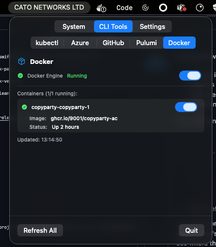

# macOS menu bar app for system and CLI tool info

# Requirements
- macOS 26+
- `kubectl`, `az`, `gh`, `pulumi`, `docker` 

# Vibes
All Swift code made with vibes.

# Install
- [Download release](https://github.com/jensbech/isp-name/releases)

# Capabilities
- Menubar title modes: ISP / Audio Output Device / Currently Playing track.
- System: public IP, org/ASN, city, country, CPU %, memory %, disk usage.
- Audio: current output device (auto refresh) and currently playing track (fast refresh timer).
- Kubernetes: current context + switcher, list of contexts.
- Azure CLI: current subscription + switcher, list of available subscriptions.
- GitHub CLI: user login/name/company/location, recent authored PRs.
- Pulumi CLI: user/orgs info (from `pulumi whoami -v -j`).
- Docker: engine status, start/stop engine (if applicable), container list with start/stop per container.
- Click any value to copy (brief copied indicator shown).
- Manual context / subscription switching triggers immediate refresh.
- Launch at Login toggle

# Build from source
- `just` is required: `brew install just`
- Build: `just build`
- Compile: `just bundle`
- Zip release: `just zip`
- Install into your Applications: `just install`gg